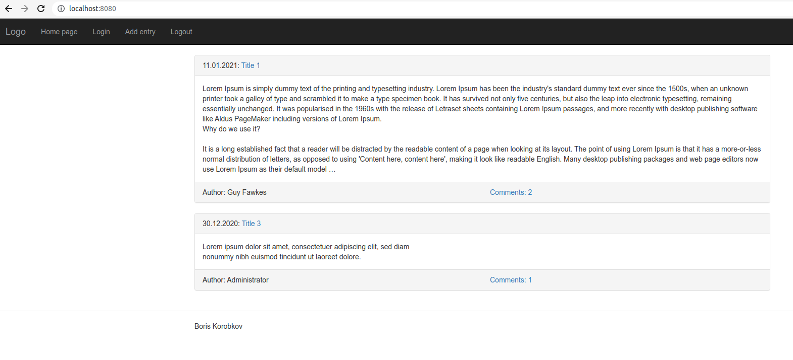
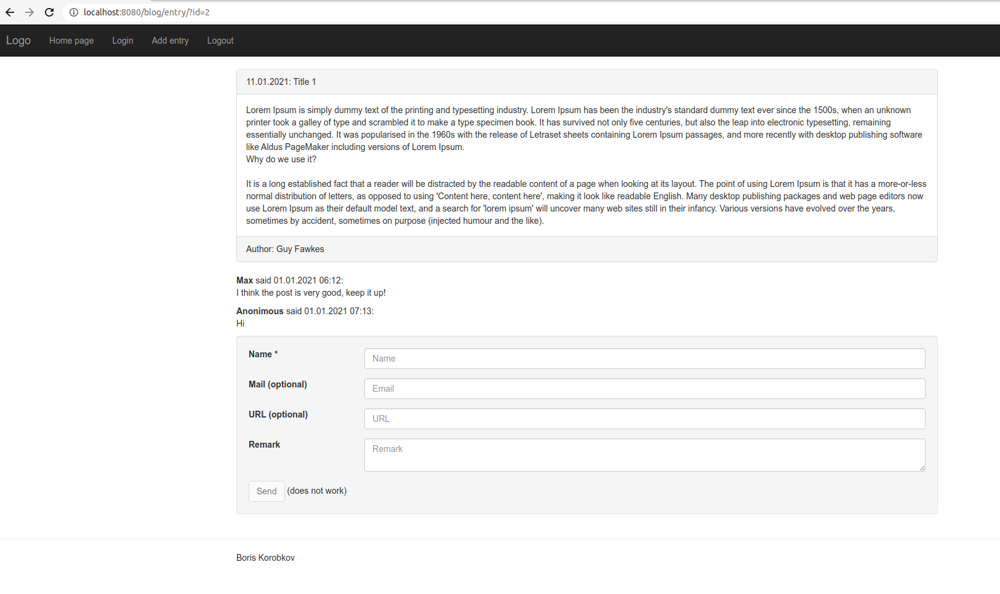

# Code example

When I was interviewed like a PHP backend developer, one of the tasks was:

_Create a site from scratch in pure PHP without using third-party libraries (except CSS). 
It should be a blog with ~~blackjack and hookers~~ tasks and (optional) comments._

I implemented all files in 4 hours. The idea of MVC is based on Yii framework, but I created everything from scratch and didn't copy anything.

Later I added `docker/` to show my knowledge as a DevOps.

## Install

### With Docker

* Run `composer docker:build` to build a docker image.
  * Also, you can run the corresponding command from `composer.json`.
  * In Ubuntu use root-account or `sudo ...`.
* Run `composer docker:up` to start docker containers.
* Open <http://127.0.0.1:8080/> in a browser. 
  Adminer is [http://127.0.0.1:8081/](http://localhost:8081/?server=db&username=boris&db=code_example) (password "korobkov").
  If you prefer another ports - set them to ENV-variables `NGINX_PORT` and `ADMINER_PORT`.
* Press `Ctrl + C` to stop docker containers.
* Run `composer docker:rm` to drop docker containers and volumes.

#### Docker with x-Debug and editing source code

* See commands above, but run `composer docker:xdebug-up` instead of `composer docker:up`
* Config your IDE. For example WebStorm or PhpStorm:
  * File / Settings / PHP / Debug / Xdebug: "9000,9003", "Can accept external connections".
    [See details](https://www.jetbrains.com/help/phpstorm/configuring-xdebug.html#integrationWithProduct)
  * "Start listening for PHP Debug Connection"
  * Create and run a bookmark in your browser:
    `javascript:(/** @version 0.5.2 */function() {document.cookie='XDEBUG_SESSION='+'PHPSTORM'+';path=/;';})()`
  * Create a server. PHP / Servers / + / Use mapping: set "Absolute path on the server" to "/var/www"
* If you want to use `curl` or `Postman` - add a GET-param for xDebugging: <http://127.0.0.1:8080/?XDEBUG_SESSION_START=1>

### Without Docker

* Create a MySQL-user, a MySQL-DB, apply files `src_php/migration/*.sql`.
* Create ENV-variables: `DB_DATABASE`, `DB_USER`, `DB_PASSWORD`.
* Config your web-server (Nginx or Apache) and point it to `src_php/web`

## How it looks

## Author

[Boris Korobkov](mailto:boriskorobkov@gmail.com)
