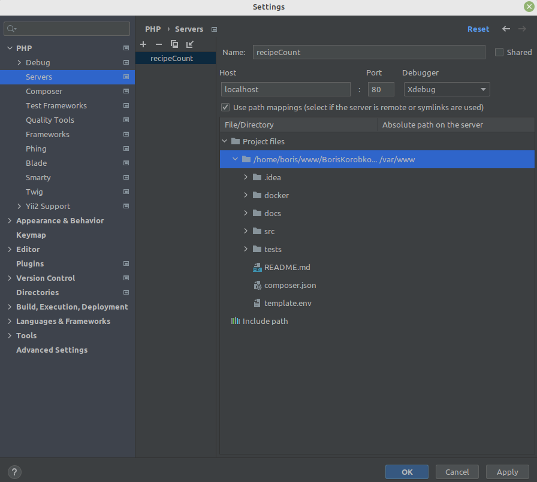

# Recipe Stats Calculator

The application...

1. loads a JSON-file, unzip it, parse it,
2. calculates some counters,
3. returns the result of counters to stdout.

## Requirements

* [Docker](https://www.docker.com/)
* Depending on your operating system, you may need to have root access. For example, for Linux, all commands must be executed with `sudo`.

## Installation

Build docker image:

    docker build --tag boriskorobkov/recipe-count:dev -f docker/Dockerfile --target php-dev .

The running time of the script depends on the speed of your internet.
The first time is about 1 minute, all next times - 1 second.

## Run

    docker run --env-file template.env boriskorobkov/recipe-count:dev php src/index.php

The running time of the script depends on the size of the file with fixtures and the speed of your internet.
For example, a 1 Gb file on AWS with 1M records works about 1 minute. Local file with several entries - 1 second.
You should see [a JSON-output](docs/output.json).

If you want to use another fixtures or counters:

1. Copy `template.env` to `.env`
2. Update value in `.env`. See comments in the ENV-file for details.
3. Run with the new ENV-file (`.env` instead of `template.env`):

    docker run --env-file .env boriskorobkov/recipe-count:dev php src/index.php

Fixtures must be in JSON-format.

* HTTP URL or local path to a file with fixtures.
* It's possible to use an archive. Supported formats: .json, .json.gz, .json.tar.gz
* Each key-value and each bracket has to be in a new line.
* The delivery time must be within one calendar day.

## Tests

### Unit-tests

    docker run boriskorobkov/recipe-count:dev php tests/unit/index.php

You should see [test names and "+" for each successful test](docs/output_unit_tests.txt). If you see an error message - something went wrong.

### Integration tests

It works on Linux and macOS only. It's not compatible with Windows (sorry for this ugly code, I didn't have enough time for this).

    cd tests/integration && ./test.sh && cd ../..

You should see nothing - it means "all tests passed successfully". If you see an error message - something went wrong.

## DEV

### Volumes

If you want to use new local fixtures (not from HTTP) or modify PHP scripts - map local folder inside the docker container.
For Linux and macOS: `-v $(pwd):/var/www`. For Windows: `-v \absolute\path\in\your\local\computer:/var/www`.
For example:

    docker run -v $(pwd):/var/www --env-file template.env boriskorobkov/recipe-count:dev php src/index.php

### Xdebug

* Config your IDE, allow external Xdebug on port 9003, set file mapping. For example, in PhpStorm:
    * "File" / "Settings" / "PHP" / "Debug" / "Xdebug" / "Debug port" = "9003", "Can accept external connections"
      
    * "File" / "Settings" / "PHP" / "Servers" / "+" / "Name" = "recipeCount", "Host" = "localhost", "Debugger" = "Xdebug", "Use file mappings",
      for your local project folder set "Absolute path on the server" = "/var/www"
      
    * Click to button "Start Listening for PHP Debug Connections"
    * Set a breakpoint in the PHP script you want to debug
    * See details in [PHPStorm help](https://www.jetbrains.com/help/phpstorm/configuring-xdebug.html)
* Enable Xdebug inside the docker container: `-v $(pwd)/docker/php-xdebug.ini:/usr/local/etc/php/conf.d/php-xdebug.ini`
* Set a server name: `-e PHP_IDE_CONFIG="serverName=recipeCount"`
* For Linux add a host: `--add-host=host.docker.internal:host-gateway` (for macOS and Windows it's not necessary)
* Start Xdebug for the exact PHP CLI: `XDEBUG_SESSION=1 php tests/unit/index.php`

The whole command:

    docker run -v $(pwd):/var/www -v $(pwd)/docker/php-xdebug.ini:/usr/local/etc/php/conf.d/php-xdebug.ini -e PHP_IDE_CONFIG="serverName=recipeCount" --add-host=host.docker.internal:host-gateway boriskorobkov/recipe-count:dev /bin/sh -c 'XDEBUG_SESSION=1 php tests/unit/index.php'

### Composer

All commands can be run with Composer, but first you should install PHP and Composer to your local computer:

    composer run docker:build
    composer run docker:run
    composer run docker:unit-tests
    composer run docker:unit-tests-xdebug
    composer run docker:integration-tests

## PROD

Build docker image for PROD (without tests):

    docker build --tag boriskorobkov/recipe-count:prod -f docker/Dockerfile --target php-prod .
