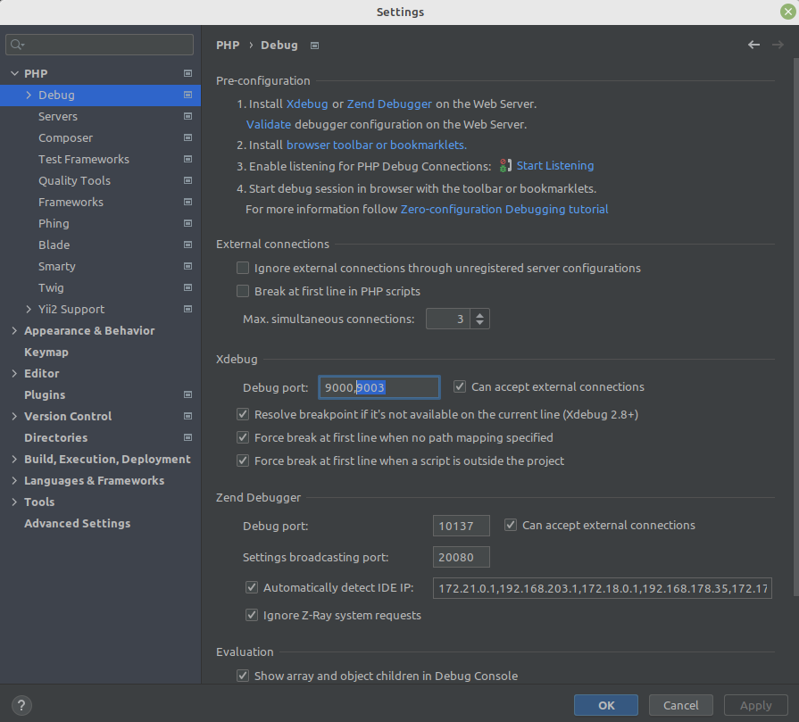
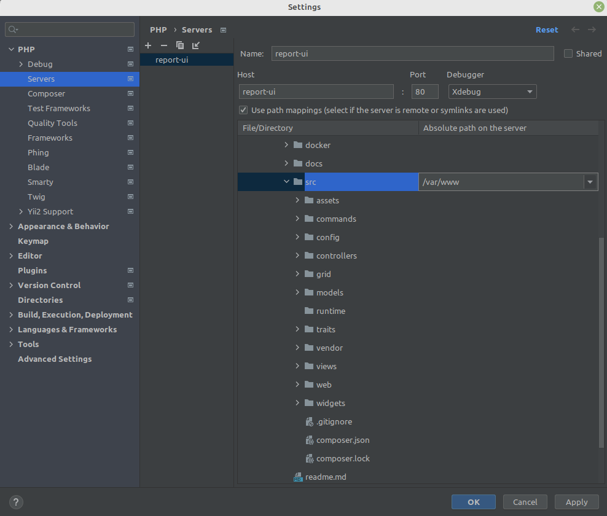
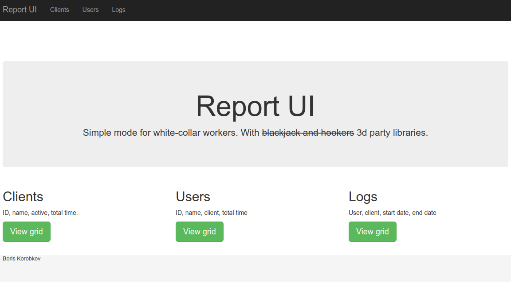
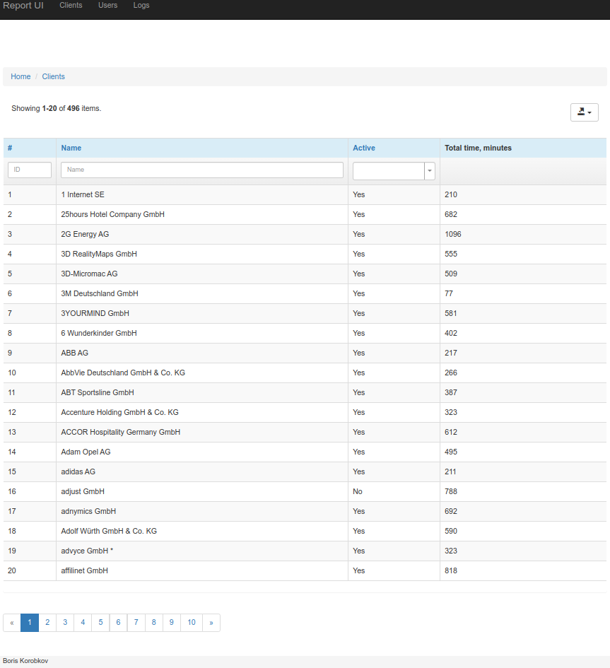
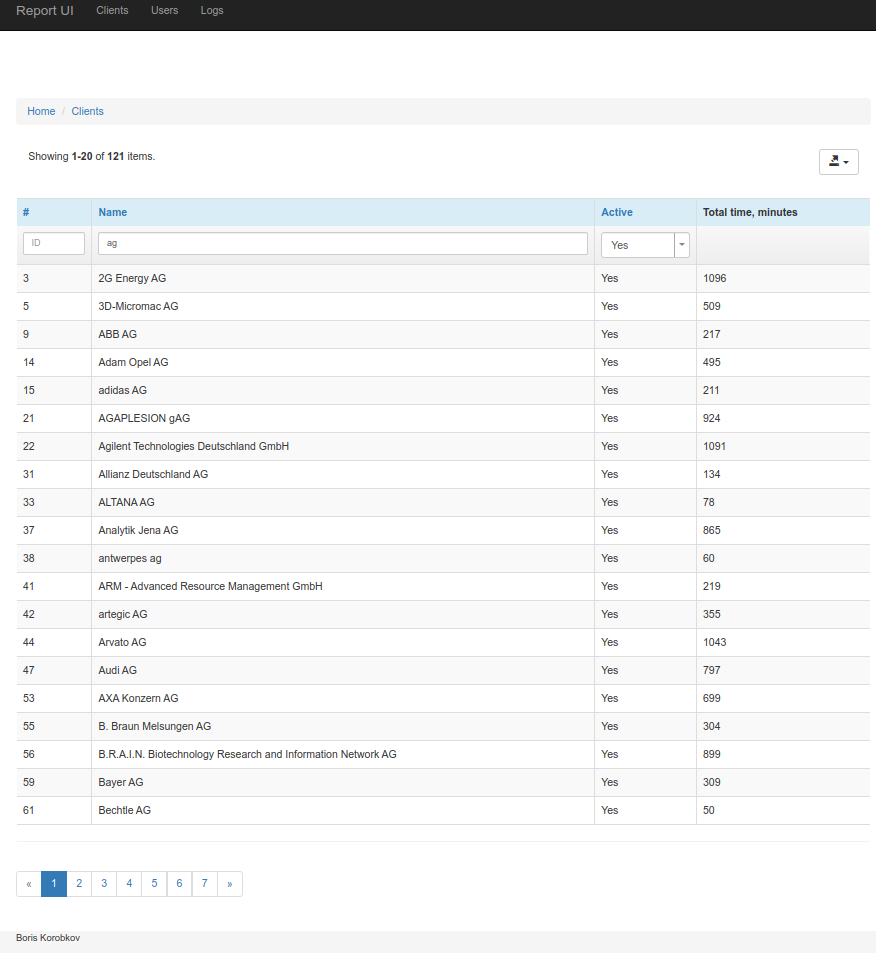
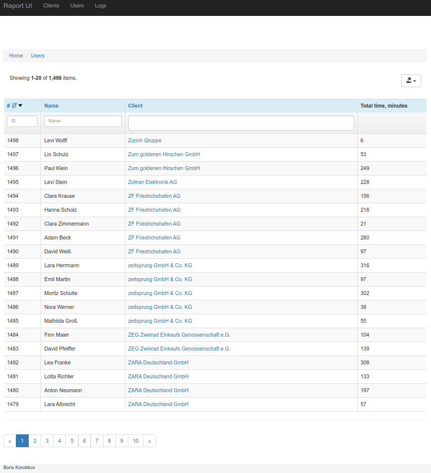
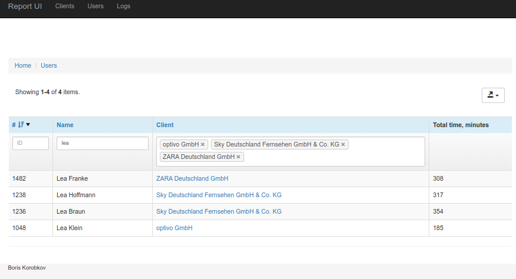
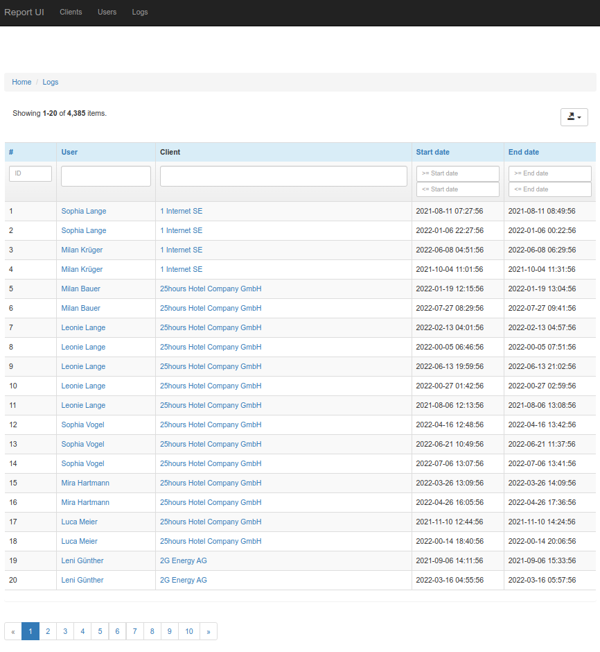
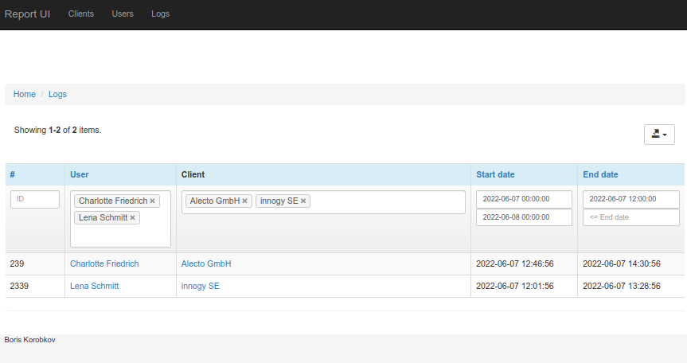
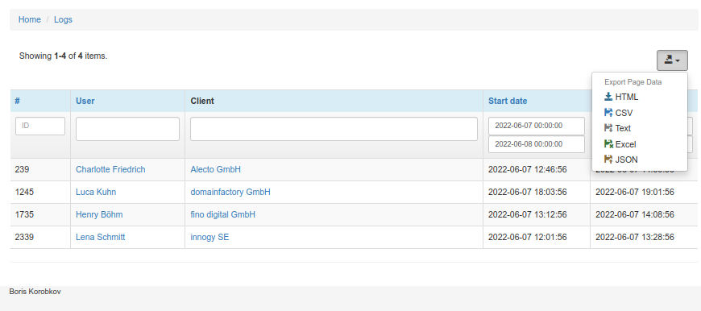

# Reports UI

Simple mode for white-collar workers. With ~~blackjack and hookers~~ 3d party libraries.

## Owner's manual

### Build docker image

    docker build --tag boriskorobkov/report-ui:dev -f docker/php/Dockerfile --target php-dev ./src

### Run

#### Prod with installed Traefik

    docker compose --env-file docker/docker-compose.env -f docker/docker-compose.yml -f docker/docker-compose.traefik.yml --project-name report-ui up

If you want to demonize, then add ` -d`

If you have Docker Swarm, then add ` -f docker/docker-compose.swarm.yml`

* Report UI: [https://report.korobkov.su/](https://report.korobkov.su/). You can set different domain in [docker/docker-compose.env](docker/docker-compose.env)
* Adminer: [https://adminer.report.korobkov.su/](https://adminer.report.korobkov.su/?server=db&username=boris&db=report), password `korobkov`

#### Local with exposed ports

    docker compose --env-file docker/docker-compose.env -f docker/docker-compose.yml -f docker/docker-compose.expose.yml --project-name report-ui up

* Report UI: [http://localhost:8080/](http://localhost:8080/). You can set different port in [docker/docker-compose.env](docker/docker-compose.env)
* Adminer: [http://localhost:8081/](http://localhost:8081/?server=db&username=boris&db=report), password `korobkov`

If you want to use PHP xDebug, then add ` -f docker/docker-compose.xdebug.yml`

Install dependencies to your local computer

    docker run -it --volume="$PWD/src":/var/www --entrypoint /bin/sh boriskorobkov/report-ui:dev -c 'composer install'

Log in inside the docker container

    docker exec -it report-ui-php-1 sh

Config your IDE, allow external Xdebug on port 9003, set file mapping. For example, in PhpStorm:

* "File" / "Settings" / "PHP" / "Debug" / "Xdebug" / "Debug port" = "9003", "Can accept external connections"

* "File" / "Settings" / "PHP" / "Servers" / "+" / "Name" = "recipeCount", "Host" = "localhost", "Debugger" = "Xdebug", "Use file mappings",
  for your local project folder "src" set "Absolute path on the server" = "/var/www"

* Click to button "Start Listening for PHP Debug Connections"
* Set a breakpoint in the PHP script you want to debug
* See details in [PHPStorm help](https://www.jetbrains.com/help/phpstorm/configuring-xdebug.html)

## Users manual

### Main page

### Clients

You can use filters ("AND"):

* "ID" - equal
* "Name" - case-insensitive occurrences of substring 
* "Active" - "" (any value), "Yes", "No"

### Users

You can use filters ("AND"):

* "ID" - equal
* "Name" - case-insensitive occurrences of substring
* "Client" - multi-select ("OR")

### Logs

You can use filters ("AND"):

* "ID" - equal
* "User" - multi-select ("OR")
* "Start date" - min and max datetime
* "End date" - min and max datetime

### Export

In all grids it's possible to export rows in different formats (HTML, CSV, Text, Excel, JSON). Limitation: only the current page (max 20 rows).

